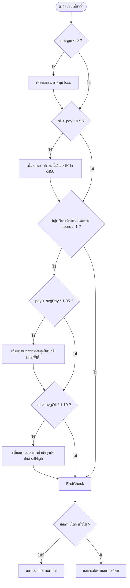

# เอกสารเงื่อนไขการคำนวณและเกณฑ์การกรองสถานะความผิดปกติ
## (Daily Comparison & Anomaly Classification Specification)

เอกสารฉบับนี้อธิบายรายละเอียดเกี่ยวกับเกณฑ์ทางคณิตศาสตร์ สูตรการคำนวณ และเงื่อนไขการแสดงผลสำหรับการกรองสถานะความผิดปกติ (**กรองสถานะ / Filter Status**) ในหน้า **"วิเคราะห์และเปรียบเทียบผลการดำเนินงาน"** ของระบบแดชบอร์ด เพื่อให้ทีมพัฒนาและฝ่ายควบคุมการดำเนินงานใช้เป็นมาตรฐานอ้างอิงร่วมกัน

---

## 📌 บทนำ (Overview)
หน้าการวิเคราะห์และเปรียบเทียบผลการดำเนินงานมีระบบตรวจจับสัญญาณความผิดปกติ (**Anomaly Detection**) แบ่งออกเป็น 2 มุมมองหลัก:
1. **มุมมองช่วงเวลาเดียว (Single-Period / Trip-Level):** ตรวจสอบความผิดปกติของแต่ละเที่ยววิ่งเปรียบเทียบกับค่าเฉลี่ยของเส้นทางนั้นๆ ในช่วงเวลาเดียวกัน
2. **มุมมองเปรียบเทียบสองช่วงเวลา (Compared / A-B Pair):** จับคู่เที่ยววิ่งจากผู้ขับคนเดียวกัน ทะเบียนเดียวกัน และเส้นทางเดียวกัน เพื่อเปรียบเทียบผลต่างของช่วงเวลาหลัก (**วันที่หลัก - Period A**) กับช่วงเวลาเปรียบเทียบ (**วันที่เปรียบเทียบ - Period B**)

---

## 1. เกณฑ์การกรองสถานะสำหรับ "มุมมองช่วงเวลาเดียว" (Single-Period / Trip-Level)
ประมวลผลผ่านฟังก์ชันหลัก `dcQaTripStatuses(trip, peers)` ซึ่งจะตรวจสอบข้อมูลของแต่ละเที่ยววิ่ง ($trip$) เทียบกับเที่ยววิ่งอื่นๆ ในเส้นทางเดียวกันช่วงเวลาเดียวกัน ($peers$) มีเกณฑ์และสูตรการคำนวณดังนี้:

### 📋 ตารางรายละเอียดเกณฑ์ตัวกรองช่วงเวลาเดียว

| ชื่อสถานะในระบบ | ข้อความแสดงผลบนหน้าจอ | สูตรคำนวณและเงื่อนไขทางคณิตศาสตร์ |
| :--- | :--- | :--- |
| **`loss`** | ขาดทุน | $margin < 0$ |
| **`oil50`** | สำรองน้ำมัน > 50% | $oil > (pay \times 0.5)$ *และ* $pay > 0$ |
| **`payHigh`** | ราคาจ่ายสูงผิดปกติ | $pay > (avgPay \times 1.05)$ *โดยมีเงื่อนไขร่วมคือจำนวนเที่ยววิ่งร่วมเส้นทางในกลุ่ม ($peers$) ต้องมากกว่า 1 เที่ยว* |
| **`oilHigh`** | สำรองน้ำมันสูงผิดปกติ | $oil > (avgOil \times 1.10)$ *โดยมีเงื่อนไขร่วมคือจำนวนเที่ยววิ่งร่วมเส้นทางในกลุ่ม ($peers$) ต้องมากกว่า 1 เที่ยว* |
| **`normal`** | ปกติ | ไม่เข้าเงื่อนไขความผิดปกติใดๆ ข้างต้นเลย |

---

### 💡 ตัวอย่างการคำนวณและกรณีใช้งาน (Single-Period Examples)

#### 🔴 กรณีตัวอย่างที่ 1.1: สถานะ "ขาดทุน" (loss)
* **ข้อมูลเที่ยววิ่ง:** ราคารับ ($recv$) = $5,000$, ราคาจ่าย ($pay$) = $4,500$, สำรองน้ำมัน ($oil$) = $600$
* **สูตรคำนวณส่วนต่าง:**
  $$margin = recv - pay - oil$$
  $$margin = 5,000 - 4,500 - 600 = -100 \text{ บาท}$$
* **ผลลัพธ์:** เนื่องจาก $margin = -100$ (น้อยกว่า 0) ระบบจะติดแท็ก **"ขาดทุน"** ทันที

#### 🟠 กรณีตัวอย่างที่ 1.2: สถานะ "สำรองน้ำมัน > 50%" (oil50)
* **ข้อมูลเที่ยววิ่ง:** ราคาจ่าย ($pay$) = $3,000$, สำรองน้ำมัน ($oil$) = $1,600$
* **สูตรคำนวณ:**
  $$3,000 \times 0.5 = 1,500 \text{ บาท}$$
* **ผลลัพธ์:** เนื่องจากสำรองน้ำมันจริง ($1,600$) สูงกว่า $50\%$ ของราคาจ่าย ($1,500$) ระบบจะติดแท็ก **"สำรองน้ำมัน > 50%"**

#### 🟡 กรณีตัวอย่างที่ 1.3: สถานะ "ราคาจ่ายสูงผิดปกติ" (payHigh)
* **ข้อมูลเที่ยววิ่งวิเคราะห์:** ราคาจ่าย ($pay$) = $3,800$
* **ข้อมูลเพื่อนร่วมเส้นทาง (Peers):** มีเที่ยววิ่งในเส้นทางเดียวกันทั้งหมด 4 เที่ยว มีค่าจ่ายดังนี้: $3,200$, $3,000$, $3,400$, $3,800$
* **สูตรคำนวณ:**
  1. หาค่าเฉลี่ยราคาจ่าย ($avgPay$):
     $$avgPay = \frac{3,200 + 3,000 + 3,400 + 3,800}{4} = 3,350 \text{ บาท}$$
  2. คำนวณเกณฑ์ควบคุม ($1.05 \times avgPay$):
     $$3,350 \times 1.05 = 3,517.50 \text{ บาท}$$
* **ผลลัพธ์:** เนื่องจากราคาจ่ายจริง ($3,800$) สูงกว่าเกณฑ์ควบคุม ($3,517.50$) ระบบจะติดแท็ก **"ราคาจ่ายสูงผิดปกติ"**

---

## 2. เกณฑ์การกรองสถานะสำหรับ "การเปรียบเทียบข้อมูลสองช่วงเวลา" (Compared / A-B Pair)
ประมวลผลผ่านฟังก์ชันหลัก `dcQaCompareStatuses(ra, rb, avgPayB, avgOilB)` ซึ่งเป็นการทำงานที่ออกแบบมาเป็นพิเศษ เพื่อประเมินสัญญาณความผิดปกติเชิงเปรียบเทียบ โดยจะนำเที่ยววิ่งแต่ละคู่ที่ผ่านการจับคู่ตัวต่อตัวระหว่างช่วงเวลาหลัก ($ra$ หรือ Period A) และช่วงเวลาเปรียบเทียบ ($rb$ หรือ Period B) ของ พขร. และทะเบียนเดียวกัน มาคำนวณเปรียบเทียบเทียบกับ **ค่าเฉลี่ยของกลุ่มในช่วงเวลาเปรียบเทียบ B (Group Average of Period B)** ของเส้นทางและประเภทรถเดียวกัน เพื่อสร้างเกณฑ์เปรียบเทียบที่มีเสถียรภาพและสมเหตุสมผลทางสถิติสูงสุด

### 📋 ตารางรายละเอียดเกณฑ์ตัวกรองสองช่วงเวลา

| ชื่อสถานะในระบบ | ข้อความแสดงผลบนหน้าจอ | สูตรคำนวณและเกณฑ์เปรียบเทียบทางคณิตศาสตร์ |
| :--- | :--- | :--- |
| **`loss`** | ขาดทุน | $ra.margin < 0$  *หรือ*  $rb.margin < 0$  *(พบการขาดทุนในช่วงใดช่วงหนึ่งหรือทั้งสองช่วง)* |
| **`oil50`** | สำรองน้ำมัน > 50% | $(ra.oil > ra.pay \times 0.5 \text{ และ } ra.pay > 0)$  *หรือ*  $(rb.oil > rb.pay \times 0.5 \text{ และ } rb.pay > 0)$ |
| **`payHigh`** | ราคาจ่ายสูงผิดปกติ | $ra.pay > (avgPayB \times 1.05)$ *และ* $avgPayB > 0$  *(ราคาจ่ายของช่วงหลัก A สูงกว่า **ค่าเฉลี่ยราคาจ่ายกลุ่ม B ของเส้นทางและประเภทรถเดียวกัน** เกิน 5% เพื่อป้องกันความผันผวนของคู่เทียบรายบุคคล)* |
| **`oilHigh`** | สำรองน้ำมันสูงผิดปกติ | $ra.oil > (avgOilB \times 1.05)$ *และ* $avgOilB > 0$  *(สำรองน้ำมันของช่วงหลัก A สูงกว่า **ค่าเฉลี่ยสำรองน้ำมันกลุ่ม B ของเส้นทางและประเภทรถเดียวกัน** เกิน 5%)* |
| **`recvLow`** | ราคารับผิดปกติ | $oilPriceA = oilPriceB$ *แต่* $ra.recv \neq rb.recv$  *(ราคาน้ำมันขายปลีกเฉลี่ยของทั้งสองช่วงเท่ากัน แต่ราคารับจ้างงานกลับไม่เท่ากัน)* |
| **`normal`** | ปกติ | ไม่พบสัญญาณความผิดปกติใดๆ ข้างต้นในคู่เปรียบเทียบ |

---

> [!NOTE]
> **ระบบเกณฑ์เปรียบเทียบสำรอง (Fallback Baseline Mechanism):**
> เพื่อป้องกันกรณีที่ไม่มีเที่ยววิ่งอื่นเลยในเส้นทาง/ประเภทรถนั้นในช่วงเปรียบเทียบ B (ทำให้การคำนวณค่าเฉลี่ยล้มเหลวหรือได้ค่าศูนย์) ฟังก์ชันในระบบจะปรับปรุงการเลือกเกณฑ์โดยอัตโนมัติ:
> * $baselinePay = (avgPayB > 0) ? avgPayB : rb.pay$
> * $baselineOil = (avgOilB > 0) ? avgOilB : rb.oil$
> โดยจะยึดค่าเฉลี่ยของกลุ่ม B เป็นหลัก หากไม่มีจึงจะอนุโลมเทียบแบบตัวต่อตัวกับ $rb$ ของตนเองในอดีตโดยตรง

---

> [!IMPORTANT]
> **นิยามของคอลัมน์ "ราคารับผิดปกติ (recvLow)":**
> ปกติแล้วราคารับจ้างงานวิ่งขนส่งสินค้าจะมีราคาอ้างอิงผูกตามสูตรดัชนีราคาน้ำมันดีเซล ณ วันนั้นๆ หากวันหลัก (วันที่ A) และวันเปรียบเทียบ (วันที่ B) มีราคาน้ำมันขายปลีกหน้าปั๊มเท่ากันทุกประการ ($oilPriceA = oilPriceB$) ราคารับจ้างงานควรจะเท่ากันเสมอ หากค่าที่บันทึกไว้ในระบบต่างกัน ($ra.recv \neq rb.recv$) แสดงว่าอาจเกิดข้อผิดพลาดในการคีย์ข้อมูลราคารับ หรือการใช้ใบงานรับงานที่คลาดเคลื่อน

---

### 💡 ตัวอย่างการคำนวณและกรณีใช้งาน (Compared A-B Pair Examples)

#### 🔵 กรณีตัวอย่างที่ 2.1: สถานะ "ราคาจ่ายสูงผิดปกติ" (payHigh)
* **ข้อมูลเที่ยววิ่งวิเคราะห์ A (วันที่หลัก):** ราคาจ่าย ($ra.pay$) = $4,300 \text{ บาท}$ (พขร. นาย ก, ทะเบียนรถ AA-11)
* **ข้อมูลเที่ยววิ่งคู่เปรียบเทียบ B (วันที่เทียบ):** ราคาจ่ายของ นาย ก เอง ($rb.pay$) = $4,000 \text{ บาท}$
* **ข้อมูลเที่ยววิ่งของกลุ่มร่วมเส้นทางเดียวกัน ประเภทรถเดียวกันทั้งหมดในอดีต (Period B):** มี 4 เที่ยววิ่ง ค่าจ่ายคือ $3,900, 4,000, 4,100, 4,000$
* **สูตรคำนวณเปรียบเทียบ:**
  1. หาค่าเฉลี่ยของกลุ่มในอดีต B ($avgPayB$):
     $$avgPayB = \frac{3,900 + 4,000 + 4,100 + 4,000}{4} = 4,000 \text{ บาท}$$
  2. คำนวณเกณฑ์ควบคุมด้านราคาจ่ายสูงสุดที่ยอมรับได้ ($avgPayB \times 1.05$):
     $$4,000 \times 1.05 = 4,200 \text{ บาท}$$
* **ผลลัพธ์:** เนื่องจากราคาจ่ายจริงของ นาย ก ในช่วงหลัก A ($4,300$) สูงกว่าเกณฑ์เฉลี่ยกลุ่มควบคุมในช่วง B ($4,200$) ซึ่งเพิ่มขึ้นสูงกว่าค่าเฉลี่ยกลางเกิน $5\%$ ระบบจึงจะทำการแจ้งเตือนติดแท็ก **"ราคาจ่ายสูงผิดปกติ"** เพื่อการตรวจสอบ

#### 🟡 กรณีตัวอย่างที่ 2.2: สถานะ "ราคารับผิดปกติ" (recvLow)
* **ข้อมูลช่วงเวลาหลัก A (วันที่หลัก):** ราคาน้ำมันดีเซลวันที่ A ($oilPriceA$) = $32.94 \text{ บาท/ลิตร}$, ราคารับ ($ra.recv$) = $7,500 \text{ บาท}$
* **ข้อมูลช่วงเวลาเปรียบเทียบ B (วันที่เทียบ):** ราคาน้ำมันดีเซลวันที่ B ($oilPriceB$) = $32.94 \text{ บาท/ลิตร}$, ราคารับ ($rb.recv$) = $7,200 \text{ บาท}$
* **การตรวจเช็กเงื่อนไข:**
  1. $oilPriceA = oilPriceB$ (ราคาน้ำมันดีเซลเท่ากันเป๊ะที่ $32.94$)
  2. $ra.recv \neq rb.recv$ (ราคารับในช่วงหลักคือ $7,500$ ไม่เท่ากับ ช่วงเปรียบเทียบที่เป็น $7,200$)
* **ผลลัพธ์:** ระบบจะติดแท็กเตือน **"ราคารับผิดปกติ"** ทันที เพื่อให้ผู้ตรวจสอบตรวจสอบว่ามีจุดใดป้อนตัวเลขราคารับใบงานผิดพลาด

---

## 3. รูปแบบการแสดงผลทั้ง 3 มุมมองในโหมดเปรียบเทียบ (The 3 Comparison Views & Display Interfaces)

ในระบบวิเคราะห์และเปรียบเทียบผลการดำเนินงาน มีการจำแนกข้อมูลเส้นทางและเที่ยววิ่งออกเป็น 3 รูปแบบ เพื่อความสะดวกในการค้นหาและวิเคราะห์ความคืบหน้าของงาน โดยข้อมูลแต่ละส่วนจะแสดงผลทั้งในหน้ารายงานภายนอก (ตารางการ์ดหลัก) และเมื่อผู้ใช้คลิกเข้าไปในหน้าต่าง (Popup Modal) ด้านใน ดังนี้ครับ:

### 📋 ตารางสรุปรูปแบบการแสดงผลด้านนอก และ ด้านใน Popup

| รูปแบบรายงานการตรวจจับ | ความหมายทางธุรกิจ | การแสดงผลด้านนอก (รายงานการ์ดหลัก) | การแสดงผลด้านใน (Popup Modal รายเที่ยว) |
| :--- | :--- | :--- | :--- |
| **1. รายเส้นทางที่ถูกเปรียบเทียบ** | เส้นทางที่มีเที่ยววิ่งของ พขร. ทะเบียนเดียวกัน ปรากฏอยู่ในข้อมูลทั้งสองช่วงเวลา (มีคู่เปรียบเทียบ) | - แสดงรายละเอียดเส้นทางและปุ่มดูคู่เปรียบเทียบ - แสดงจำนวนคู่เปรียบเทียบที่ตรวจพบความผิดปกติ - พรีวิวตารางคู่เปรียบเทียบ A/B (สูงสุด 6 คู่แรก) | **คอลัมน์ในตาราง Popup:** 1. วันที่หลัก 2. วันที่เปรียบเทียบ 3. พขร. 4. ประเภทรถ 5. ทะเบียน 6. ราคาน้ำมัน (มีเดลต้าต่อท้าย) 7. สำรองน้ำมัน (มีเดลต้าต่อท้าย) 8. ราคารับ (มีเดลต้าต่อท้าย) 9. ราคาจ่าย (มีเดลต้าต่อท้าย) 10. ส่วนต่าง (margin A และ B) 11. ความผิดปกติ (แท็กแจ้งเตือน) |
| **2. รายเส้นทางที่ไม่ถูกเปรียบเทียบ: พบเฉพาะช่วงแรก** | เที่ยววิ่งของ พขร. และทะเบียนรถนั้นๆ **พบเฉพาะในช่วงเวลาหลัก (Period A)** แต่ในช่วงเวลาอดีต (Period B) ไม่มีประวัติการวิ่งร่วมกันบนเส้นทางนี้ | - แสดงรายการเที่ยววิ่งที่ไม่มีคู่เปรียบเทียบจากช่วงอดีต - แสดงแท็กแจ้งสัญญาณความผิดปกติระดับเที่ยวเดี่ยว (เช่น ขาดทุน) - แสดงปุ่มเปิดดูรายละเอียดเที่ยวเดี่ยวช่วงแรก | **คอลัมน์ในตาราง Popup:** 1. วันที่ (วันที่หลัก A) 2. พขร. 3. ประเภทรถ 4. ทะเบียน 5. ราคาน้ำมัน 6. สำรองน้ำมัน 7. ราคารับ 8. ราคาจ่าย 9. ส่วนต่าง 10. ความผิดปกติ (แท็กแจ้งเตือน) |
| **3. รายเส้นทางที่ไม่ถูกเปรียบเทียบ: พบเฉพาะช่วงหลัง** | เที่ยววิ่งของ พขร. และทะเบียนรถนั้นๆ **พบเฉพาะในช่วงเปรียบเทียบ (Period B)** แต่ในช่วงเวลาปัจจุบัน (Period A) ไม่มีประวัติการวิ่งร่วมกันบนเส้นทางนี้ | - แสดงรายการเที่ยววิ่งเดี่ยวในอดีตที่ไม่มีงานวิ่งในช่วงหลักปัจจุบัน - แสดงแท็กแจ้งสัญญาณความผิดปกติระดับเที่ยวเดี่ยวในอดีต - แสดงปุ่มเปิดดูรายละเอียดเที่ยวเดี่ยวช่วงหลัง | **คอลัมน์ในตาราง Popup:** 1. วันที่ (วันที่เทียบ B) 2. พขร. 3. ประเภทรถ 4. ทะเบียน 5. ราคาน้ำมัน 6. สำรองน้ำมัน 7. ราคารับ 8. ราคาจ่าย 9. ส่วนต่าง 10. ความผิดปกติ (แท็กแจ้งเตือน) |

---

## 4. สูตรคำนวณและการแสดงผลส่วนต่างเดลต้า ($\Delta$) ในตาราง Popup
เมื่อผู้ใช้คลิกเลือกเส้นทางใดๆ เพื่อดูรายละเอียดเปรียบเทียบเชิงลึกในหน้าต่าง Popup ระบบจะทำการคำนวณค่าผลต่างความเปลี่ยนแปลงของตัวเลขแต่ละรายการระหว่างช่วงเวลาหลัก (A) เทียบกับช่วงเวลาเปรียบเทียบ (B)

### 📐 สูตรการคำนวณส่วนต่างเดลต้า:
$$\Delta = A - B$$
*(ค่าในช่วงแรก/วันที่หลัก ตั้งลบด้วย ค่าในช่วงหลัง/วันที่เปรียบเทียบ)*

### 🎨 เกณฑ์การจัดรูปแบบและการแสดงผลสีอักษรเดลต้า:

| ผลต่างทางคณิตศาสตร์ | สถานะทางบัญชี/การดำเนินงาน | เครื่องหมายและสีแสดงผล | ตัวอย่างการแสดงผล |
| :--- | :--- | :--- | :--- |
| **$\Delta > 0$**  *(ค่าช่วงแรกสูงกว่าช่วงหลัง)* | **ผลดี:** สำหรับคอลัมน์ `ราคารับ` (รายได้เพิ่มขึ้น) และ `ส่วนต่าง` (กำไรดีขึ้น)  **ผลเสีย:** สำหรับคอลัมน์ `ราคาน้ำมัน` (ดีเซลแพงขึ้น) และ `ราคาจ่าย` (ต้นทุนค่าจ้างเพิ่มขึ้น) | **เครื่องหมายบวก (+)** และ **สีเขียว** (สำหรับรายได้/กำไร) หรือ **สีแดง** (สำหรับราคาจ่ายเพิ่มขึ้น) | `42.20 Δ +1.50` `7,432.00 Δ +155.00` |
| **$\Delta < 0$**  *(ค่าช่วงแรกต่ำกว่าช่วงหลัง)* | **ผลเสีย:** สำหรับคอลัมน์ `ราคารับ` (รายได้ลดลง) และ `ส่วนต่าง` (กำไรหดตัว)  **ผลดี:** สำหรับคอลัมน์ `ราคาน้ำมัน` (ดีเซลถูกลง) และ `ราคาจ่าย` (ต้นทุนประหยัดลง) | **เครื่องหมายลบ (-)** และ **สีแดง** (สำหรับรายได้ลดลง) หรือ **สีเขียว** (สำหรับราคาจ่ายประหยัดลง) | `3,200.00 Δ -300.00` |
| **$\Delta = 0$**  *(ค่าทั้งสองช่วงเท่ากัน)* | ไม่มีการเปลี่ยนแปลงของตัวเลข | **ซ่อนการแสดงผลทั้งหมด** (ไม่เรนเดอร์เครื่องหมาย Δ และ 0.00) เพื่อลดข้อมูลที่ซ้ำซ้อนบนตาราง | `4,000.00` *(ไม่มีข้อความเดลต้าต่อท้าย)* |

---

> [!NOTE]
> **เทคโนโลยีและการจัดวางสไตล์ (UX/UI Implementation):**
> 1. เครื่องหมายเดลต้าจะวางเรียงต่อท้ายจากตัวเลขหลักในบรรทัดเดียวกันโดยเว้นวรรค 1 ครั้ง (เช่น `41.45  Δ +1.50`)
> 2. สัญลักษณ์ Δ และตัวเลขเดลต้าทั้งหมด**ไม่มีสีพื้นหลังและไม่มีขอบกล่องข้อความ** เป็นตัวหนังสือสีเรียบเนียนระดับสายตา
> 3. ข้อมูลเดลต้าจะถูกประมวลผลและ**แสดงผลเฉพาะในหน้าต่าง Popup รายละเอียดเท่านั้น** ส่วนตารางพรีวิวย่อด้านนอกจะไม่มีเดลต้าแสดง เพื่อให้การนำเสนอข้อมูลในหน้าหลักดูคลีน โปร่งสบายตา และเข้าถึงง่ายที่สุด

